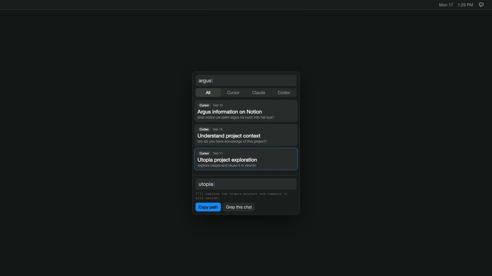

# ChatVault

<p align="center">
  
</p>

<p align="center">
  <a href="https://github.com/akshayram1/ChatVault/raw/main/assets/brag.mp4">▶ Watch the demo</a>
</p>

A small Mac app that finds Cursor, Claude Code, and Codex chats already stored on this Mac. Search by name, sort by date, grep a jsonl, copy the path. Nothing is uploaded.

It works on any Mac. Paths are built from that user’s Home folder. If a tool is not installed, that source is skipped.

## Install

One command, no need to clone this repo. Downloads the latest release, installs it to `~/Applications`, and launches it:

```bash
curl -fsSL https://raw.githubusercontent.com/akshayram1/ChatVault/main/scripts/remote-install.sh | bash
```

## Uninstall

```bash
curl -fsSL https://raw.githubusercontent.com/akshayram1/ChatVault/main/scripts/uninstall.sh | bash
```

## Build from source

Needs macOS 14+ and Xcode Command Line Tools.

```bash
chmod +x scripts/build-app.sh
./scripts/build-app.sh
open dist/ChatSessions.app
```

Or run `./scripts/install.sh` after cloning to build and install to `~/Applications` in one step.

First launch is unsigned (ad-hoc). Right-click → Open the first time, or System Settings → Privacy & Security.

## Permissions

On first open the app explains what it reads and shows status for:

- `~/.cursor/projects` — Cursor chats
- Cursor Application Support database — chat titles
- `~/.claude/projects` — Claude Code chats
- `~/.codex` — Codex chats

If macOS blocks a folder: **Grant Access** (file picker) or **Select Home folder**. If it is still blocked: **Full Disk Access**. Re-open **Access → Folder access…** later.

The app never sends chats anywhere. It only reads local files.

## Use

1. Allow access, then wait for the scan.
2. Filter All / Cursor / Claude / Codex. Type in the search field.
3. Pick a chat (newest first).
4. Grep that jsonl. Copy path if you want to paste it into an agent.

Grok chats are Cursor chats. Cloud Code is Claude Code.
